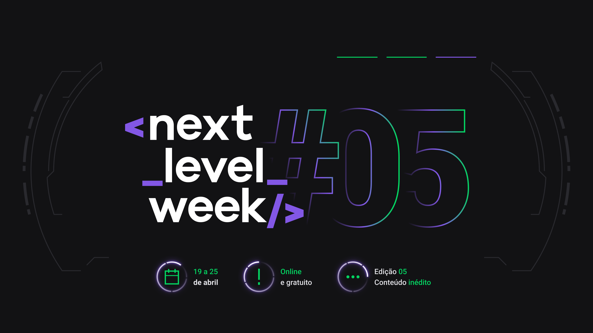

<h1 align="center">
   
</h1>

<h1 align="center">
   
    <br>Next Level Week <br/>
    
    <br>
    Next.js | React.js | Node.js
</h1>

<p align="center">
  
  
   
  <br/>
</p>
<p align="center">
  <a href="#book-about">About</a>&nbsp;&nbsp;&nbsp;|&nbsp;&nbsp;&nbsp;
  <a href="#newspaper-figma">Figma</a>&nbsp;&nbsp;&nbsp;|&nbsp;&nbsp;&nbsp;
  <a href="#rocket-technology">Technologies</a>&nbsp;&nbsp;&nbsp;|&nbsp;&nbsp;&nbsp;
  <a href="#boom-how-to-run">How to run</a>&nbsp;&nbsp;&nbsp;|&nbsp;&nbsp;&nbsp;
  <a href="#memo-license">License</a>
</p>

<p align="center">
  
<p>

## :book: About

The podcast is a medium of entertainment that has grown a lot in recent times mainly due to the easy access and thus, it can be united with the other activities of the day to day.
**Podcastr** is immersive and helps you with technology and programming studies.

You can see my notes here [Notion](https://www.notion.so/Next-Level-Week-b9340ecd4b3d43c0ba50bf9741133a28)


  
This application made was during the **Next Level Week #5**, project made by [Rocketseat](https://rocketseat.com.br/).

## :newspaper: Figma


**Figma**

[](https://www.figma.com/file/Ac8023WDzPi1snfkYCLw6j/Podcastr?node-id=160%3A2761)

## :rocket: Technology

-  [Typescript](https://www.typescriptlang.org/)
-  [Next.js](https://nextjs.org/)
-  [React.js](https://reactjs.org/)
-  [Node.js](https://nodejs.org/en/)
-  [Json-server](https://www.npmjs.com/package/json-server/)
-  [Date-fns](https://date-fns.org/)
-  [Sass](https://sass-lang.com/)

## :boom: How to run

- ### **Prerequisites**

  - It's **necessary** to have **[Node.js](https://nodejs.org/en/)** installed on the computer
  - It's  **necessary** to have  **[Git](https://git-scm.com/)** installed and configured on the computer
  - It's also **need** have a package manager be the **[NPM](https://www.npmjs.com/)** or **[Yarn](https://yarnpkg.com/)**.

1. Clone the repository:

```sh
  $ git clone https://github.com/wmaidson/Podcastr.git
```

2. Running the Application:

```sh
  # API
  $ cd podcastrnext
  # Installing the project dependencies.
  $ yarn or npm install
  # Setting up the database.
  $ npm install -g json-server

  # Start the Server
  $ yarn server
  
  # Start the API
  $ yarn build && yarn start

  # If all goes well it will start the server on localhost port 3000
  $ Open your browser and access the address: 'http://localhost:3000',
```

## :memo: License

This project is under the MIT license. See the archive [LICENSE](LICENSE.md) for more details.

---
<sup>Project developed with the tutorship of [Diego Fernandes](https://github.com/diego3g), by [Rocketseat](rocketseat.com.br).</sup>

## :headphones: Application

**You can test the application here:** [Podcastr](https://wpodicastr.herokuapp.com)